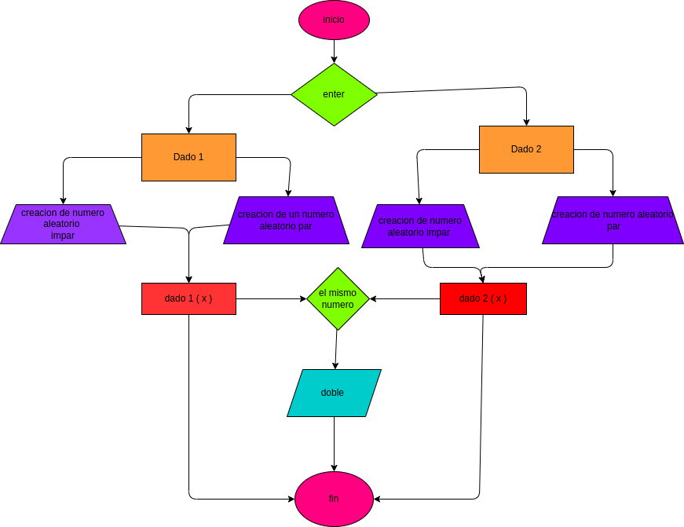

# movimiento de dados
Un programa que use un sistema aleatorio para que dos dados tengan numeros al azar

## simula el movimiento de dados para tener dos numeros random

# Analisis 
presionar enter para tener variables de
dado 1 (x)
dado 2 (x)

# Diseño 

# Construccion
hacer un programa que use el sistema de numeros aleatorios 
